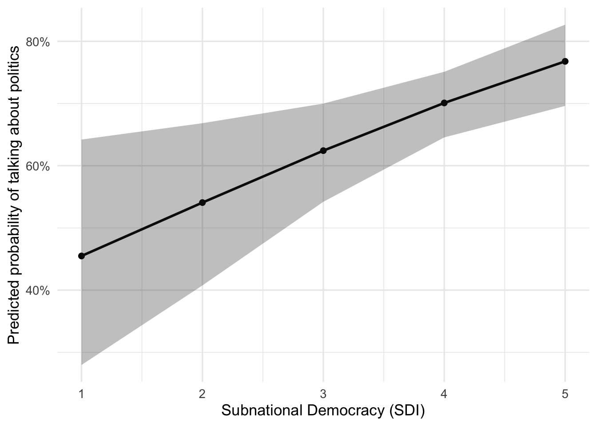
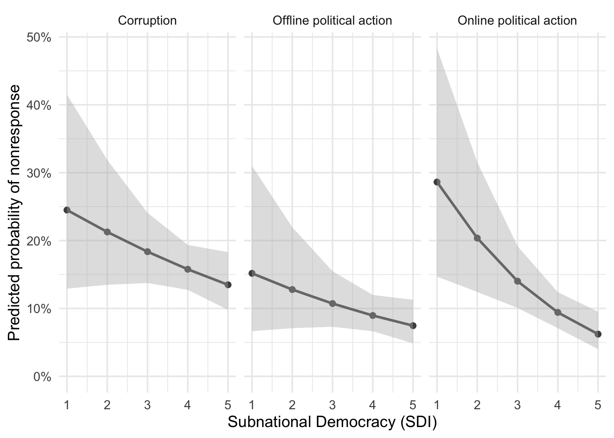

How Local Regime Type Shapes Political Expression: Self-Censorship in
Argentina’s Subnational Units
================
A reproducible computational social science project combining survey
data and province-level democratic indicators to examine political
expression and self-censorship across Argentina.

## Abstract

This project examines how subnational democratic contexts shape
political self-censorship in Argentina. Using data from the 2017 World
Values Survey and Gervasoni’s Subnational Democracy Index, it analyzes
whether variation in provincial democratic quality is associated with
citizens’ willingness to express political opinions.

Self-censorship is operationalized through two complementary measures:
reported discussion of politics with others and nonresponse to
politically sensitive survey items. Multilevel models show that higher
levels of subnational democratic quality are associated with lower
conversational self-censorship, with respondents in more democratic
provinces being more likely to report talking about politics. For
sensitive-item nonresponse, the association with subnational democracy
is more domain-specific, with the clearest relationship appearing for
online political action items.

The findings suggest that political self-censorship manifests
differently depending on the setting in which expression occurs:
subnational democratic context is especially consequential for socially
visible political discussion, while private survey nonresponse reflects
a more heterogeneous combination of contextual and individual-level
factors.

## Research Question

How does local regime type shape individuals’ propensity for political
self-censorship in Argentina’s provinces?

## Data Sources

This project uses two main data sources:

- World Values Survey Wave 7, Argentina sample (Haerpfer et al., 2022):
  individual-level survey data on political attitudes, behaviors, and
  demographic characteristics.
- Subnational Democracy Index (Gervasoni, 2018): province-level measure
  of democratic quality and political competitiveness in Argentina.

The analysis includes respondents from 13 Argentine subnational units
represented in the World Values Survey sample.

> Original survey microdata are not included in this public repository.
> The repository contains documentation of the data sources, variable
> construction, and reproducible analysis scripts.

## Outcome Measures

The project operationalizes political expression and self-censorship
through two complementary dependent variables:

- **Talking about politics (DV1):** whether respondents report
  discussing political matters, interpreted as a measure of
  interpersonal political expression.
- **Nonresponse to politically sensitive survey items (DV2):** the
  number of `NA/DK` responses within thematic groups of sensitive
  political questions, interpreted as a probabilistic indicator of
  expressive reticence in a private survey setting.

For DV2, sensitive items are grouped into three political domains:

- **Corruption perceptions**
- **Offline political action**
- **Online political action**

This distinction makes it possible to examine whether subnational
democratic context is associated with interpersonal political expression
and whether patterns of survey nonresponse vary across different domains
of sensitive political content.

## Methods

The analysis uses multilevel modeling to account for individuals nested
within Argentina’s provinces. Because the two outcomes have different
structures, each analytical component applies a model specification
appropriate to its dependent variable.

The analytical workflow includes:

- Data preparation and variable construction
- Descriptive statistics
- Multilevel statistical modeling with province-level random intercepts
- Individual-level and contextual controls
- Robustness checks using alternative model specifications and
  operationalizations
- Predicted probability estimates and visualizations

### DV1: Talking about Politics

For the first dependent variable, the analysis uses multilevel logistic
regression models with province-level random intercepts. These models
estimate the relationship between subnational democracy and respondents’
likelihood of reporting that they talk about politics, while accounting
for individual-level characteristics and provincial clustering.

As a robustness check, the DV1 specification is re-estimated using
single-level logistic regression without province-level random effects.

### DV2: Nonresponse to Politically Sensitive Items

For the second dependent variable, the analysis uses three separate
binomial multilevel models, corresponding to distinct thematic groups of
sensitive political items:

- Corruption perceptions
- Offline political action
- Online political action

In each model, the outcome is the number of `NA/DK` responses within the
thematic group relative to the total number of items in that group.
Estimating the models separately allows the analysis to assess whether
subnational democratic context is associated with nonresponse
differently across domains of political expression.

As a robustness check, DV2 is also re-estimated using a binary indicator
capturing whether a respondent leaves at least one sensitive item
unanswered across all item groups. This alternative operationalization
captures the presence of survey-based self-censorship rather than its
intensity or domain-specific manifestation.

## Key Findings

- Higher subnational democratic quality is associated with lower
  conversational self-censorship: respondents in more democratic
  provinces are more likely to report talking about politics with
  others.
- For self-censorship operationalized through sensitive-item
  nonresponse, the relationship with subnational democracy is weaker and
  domain-specific, with the clearest association appearing for online
  political action items.
- Once individual-level controls are included, provincial democratic
  context becomes a less consistent predictor of survey-based
  self-censorship, while several individual-level characteristics remain
  relevant.
- Overall, the findings show that political self-censorship is
  multidimensional: local regime conditions matter most for socially
  visible political discussion, while private survey nonresponse
  reflects a more heterogeneous form of expressive reticence.

## Main Result: Conversational Self-Censorship

The figure below presents the predicted probability of reporting
political discussion across levels of the Subnational Democracy Index
(SDI), where higher values indicate greater provincial democratic
quality. Respondents in more democratic provinces are more likely to
report talking about politics with others, consistent with lower levels
of conversational self-censorship.

## Additional Result: Survey-Based Self-Censorship Across Political Domains

The figure below presents predicted probabilities of item nonresponse
across levels of the Subnational Democracy Index (SDI), estimated
separately for corruption perceptions, offline political action, and
online political action items.

Although predicted item nonresponse declines across all three domains as
provincial democratic quality increases, the clearest association
appears for online political action items. This suggests that
survey-based self-censorship is not uniform across sensitive political
topics.

## Repository Structure

    ├── data/       Documentation of data sources and local folders for raw and processed files
    ├── scripts/    Reproducible R workflow: data preparation, descriptive analysis, models,
    │               robustness checks, and predicted probabilities
    ├──outputs/tables/
      ├── dv1_conversational_self_censorship_models.pdf
      ├── dv2_survey_based_self_censorship_by_domain.pdfgit add 
      └── robustness_check_results.pdf
    └── docs/       Methodological notes, variable construction, and research design documentation

## Tools and Techniques

- **Programming language:** R
- **Data preparation and visualization:** `tidyverse`, `ggplot2`
- **Statistical modeling:** multilevel logistic regression for
  interpersonal political expression; binomial multilevel models for
  domain-specific sensitive-item nonresponse
- **Robustness checks:** single-level logistic regression for DV1 and
  binary nonresponse operationalization for DV2
- **Predicted probabilities:** observed-case predictions and
  visualizations across levels of subnational democracy
- **Reproducible research workflow:** organized scripts, documented
  variables, and exported analytical outputs

## Academic Context

This project was developed as my master’s thesis for the MS in Data
Analytics and Computational Social Science at the University of
Massachusetts Amherst.

Thesis title: How Local Regime Type Shapes Political Expression:
Self-Censorship in Argentina’s Subnational Units

The thesis applies computational social science and quantitative
political behavior methods to the study of democratic variation within
countries.

## Author 

**Sabrina Victoria Corbacho** 

MS in Data Analytics & Computational Social Science, University of Massachusetts Amherst

[LinkedIn](https://www.linkedin.com/in/svcorbacho/)

## Data References

Gervasoni, C. (2018). *Hybrid Regimes within Democracies: Fiscal
Federalism and Subnational Rentier States*. Cambridge University Press.

Haerpfer, C., Inglehart, R., Moreno, A., Welzel, C., Kizilova, K.,
Diez-Medrano, J., Lagos, M., Norris, P., Ponarin, E., & Puranen, B.
(Eds.). (2022). *World Values Survey: Round Seven - Country-Pooled
Datafile Version 5.0*. Madrid, Spain & Vienna, Austria: JD Systems
Institute & WVSA Secretariat. <https://doi.org/10.14281/18241.24>

## License

This project is shared for academic and portfolio purposes.
Thesis-related written materials are licensed under a Creative Commons
Attribution-NonCommercial 4.0 International License (CC BY-NC 4.0).
